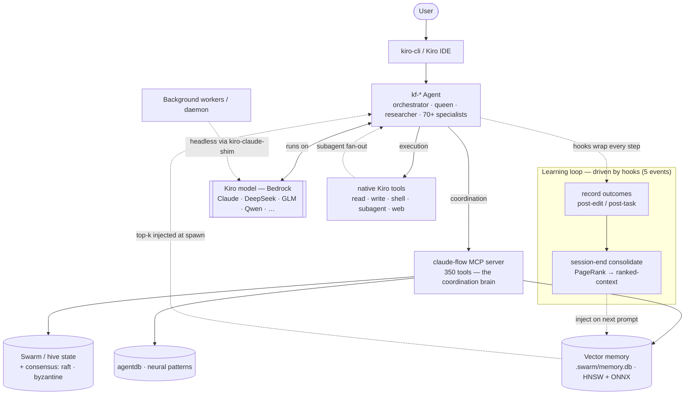

# kiro-flow

Recreates [ruflo](https://github.com/ruvnet/ruflo) (claude-flow) for **AWS Kiro** — Kiro CLI + Kiro IDE — instead of Claude Code.

## Architecture

How a request actually flows (verified against the shipping 3.23 source, not the marketing shape):

**Reading the diagram:** the agent runs on **Kiro's** model (ruflo's own provider layer is unused on this plane); the **claude-flow MCP server** is its coordination brain (memory, swarm/hive state, agentdb); **memory** is read at spawn (injected) and written by tools/hooks — it wraps the LLM call rather than sitting in series with it; **swarm/hive state** is a shared store with real consensus math, *beside* execution, not a stage the request passes through; and the **learning loop** (record → consolidate → inject) is a genuine closed feedback cycle, though lexical (trigram + PageRank) rather than the neural vocabulary the branding implies.

## Approach

Adapter, not fork. The published `ruflo` npm package's genuinely host-agnostic engine is consumed unmodified:

- **MCP server** (350 tools) — registered with Kiro via `kiro-cli mcp add` / `.kiro/settings/mcp.json`
- **Memory engine** — SQLite (FTS5/BM25) + HNSW vector hybrid search in `.swarm/memory.db`
- **Swarm coordination** — topologies, Queen coordinator, consensus, message bus
- **Worker daemon** — background workers, 12 triggers

The thin `kiro-flow` package adds what Kiro needs:

1. **Converters** — 108 agent personas → `.kiro/agents/*.json`, commands/skills → `.kiro/skills/`, CLAUDE.md → steering
2. **kiro-claude-shim** — a `claude`-compatible bin that redirects ruflo's headless worker spawns to `kiro-cli chat --no-interactive`
3. **Hook adapter** — Kiro hook events (`agentSpawn`/`preToolUse`/`postToolUse`/`stop`/`userPromptSubmit`) → ruflo's hook handlers
4. **`kiro-flow init` + one-line install.sh** — mirrors ruflo's installer for Kiro

## Layout

| Path | Purpose |
|---|---|
| `reference/ruflo/` | upstream clone (read-only, gitignored — re-clone with `git clone --depth 1 https://github.com/ruvnet/ruflo reference/ruflo`) |
| `dossiers/` | capability dossiers 00–10: the "understand every subsystem" deliverable |
| `schemas/` | JSON Schemas for generated Kiro artifacts (CI-enforced) |
| `packages/kiro-flow/` | the adapter package |
| `scripts/` | install.sh, mcp-smoke.mjs |
| `powers/` | Kiro Power bundles (Phase 3) |

## Status

- [x] M0 — workspace + baseline
- [x] M1 — ruflo MCP server registered in Kiro (350 tools; work-side checklist pending)
- [x] M2 — agent library conversion (88 from repo corpus / 73 from published bundle)
- [x] M3 — `kiro-flow init` + `kiro-flow doctor` + install.sh (work-side demo pending)
- [x] M4 — hooks mapping (kiro-hook-adapter → unmodified ruflo kernel; verified live incl. safety block, dossier 04)
- [x] M5 — headless executor (kiro-claude-shim) + workers/daemon (live worker sweep through kiro-cli verified, dossier 05)
- [x] M6 — swarm / hive-mind (kf-queen interactive plane; live hive session on Kiro mutating ruflo's own state store, dossier 06)
- [x] M7 — ambient memory + session persistence (recall cache + agentSpawn injection; A→B recall verified live, dossier 07)
- [x] M8 — self-learning / ReasoningBank (fail→consolidate→inject loop verified live; kf-judge global + shim routing, dossier 08)
- [x] M9 — deep research + command triage (kf-deep-researcher: live cited report + memory_store; kiro-flow cmd runner over 166 commands, dossier 09)
- [x] M10 — Powers packaging + distribution (powers/kiro-flow bundle, clean-machine install, final capability matrix — dossier 10)

All 10 milestones complete (home side). Final capability matrix: `dossiers/10-capability-matrix.md`.
Work-side (employer Kiro) checklists live at the end of each dossier.

Full plan: see `docs/plan.md`.

## License

MIT. Derived from ruflo, Copyright (c) 2024-2026 ruvnet — see `NOTICE`.
